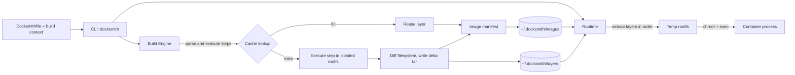

# Docksmith

**A minimal, daemonless Docker-like container build and runtime engine, built from scratch in Python using Linux OS primitives.**

Docksmith reads a `Docksmithfile`, builds a layered image with a deterministic, content-addressed build cache, and runs containers in an isolated root filesystem. It does not use Docker, runc, containerd, or any other container runtime.

It was built to show how three things work underneath container tools:

1. **Build caching and content addressing:** how layers are hashed, stored, reused, and invalidated.
2. **Process isolation:** how a process is confined to its own root filesystem at the OS level.
3. **Image assembly:** how images are put together from ordered delta layers and run as containers.

---

## Features

- **6-instruction build language:** `FROM`, `COPY`, `RUN`, `WORKDIR`, `ENV`, `CMD`, with clear line-numbered errors for anything else
- **Layered images:** every `COPY` and `RUN` produces an immutable **delta** tar layer (only added or modified files, plus whiteouts for deletions)
- **Content-addressed storage:** layers are named by the SHA-256 of their raw bytes, so identical content is stored once
- **Deterministic build cache:** `[CACHE HIT]` / `[CACHE MISS]` reporting per step, with cascading invalidation
- **Reproducible builds:** sorted tar entries and zeroed timestamps give byte-identical layers and manifests across rebuilds
- **Isolated execution:** build-time `RUN` and `docksmith run` share **one isolation primitive** (`chroot` into the assembled rootfs)
- **Fully offline:** base images are imported once, and no network access happens during build or run
- **Single CLI, no daemon:** all state lives on disk in `~/.docksmith/`
- **Optional web UI:** a Streamlit frontend for building, running, and inspecting images

---

## Architecture



### State directory

```
~/.docksmith/
├── images/     # one JSON manifest per image (name_tag.json)
├── layers/     # content-addressed tar files: sha256_<digest>.tar
└── cache/      # index.json: cache key -> layer digest
```

---

## Requirements

- **Linux** (tested on Ubuntu). macOS and Windows users should use a Linux VM.
- **Python 3.10+**
- **Root privileges** (`sudo`) for `build` and `run`, which `chroot` requires
- `ldd`, `tar`, `sha256sum` (standard on most distributions)

---

## Quick Start

### 1. Clone

```bash
git clone https://github.com/<your-username>/docksmith.git
cd docksmith
```

### 2. Import the base image (one-time, offline afterwards)

The setup script assembles a minimal base image (`base-shell:latest`) from the host's `/bin/sh`, `/bin/cat` and their shared libraries, and imports it into the local store.

```bash
bash scripts/setup_base_shell.sh
```

### 3. (Optional) Install the `docksmith` command

```bash
chmod +x docksmith.py
sudo ln -s "$(pwd)/docksmith.py" /usr/local/bin/docksmith
```

Otherwise, replace `docksmith` with `python3 docksmith.py` in the commands below.

### 4. Build and run the sample app

```bash
sudo -E docksmith build -t myapp:latest sample-app
sudo -E docksmith run myapp:latest
```

Expected output:

```
Hello from Docksmith
built-ok
Container exited with code 0
```

---

## CLI Reference

| Command | Description |
|---|---|
| `docksmith build -t <name:tag> <context>` | Parse the `Docksmithfile` in `<context>`, execute all steps in isolation, write the image manifest |
| `docksmith build --no-cache -t <name:tag> <context>` | Skip all cache lookups and writes (layers are still written) |
| `docksmith images` | List images: Name, Tag, ID (first 12 chars of digest), Created |
| `docksmith run <name:tag> [cmd...]` | Assemble the filesystem and run the container in the foreground. `[cmd]` overrides the image `CMD` |
| `docksmith run -e KEY=VALUE <name:tag>` | Override or add an environment variable (repeatable) |
| `docksmith rmi <name:tag>` | Remove the image manifest and its layer files |
| `docksmith ps` | List container run records |

Running `python3 docksmith.py` with no arguments opens an interactive shell (`docksmith>` prompt).

---

## Build Language

```dockerfile
FROM base-shell:latest
WORKDIR /app
ENV GREETING=Hello
COPY . /app
RUN /bin/sh -lc "echo built-ok > /app/build.txt"
CMD ["/bin/sh", "-lc", "echo \"$GREETING from Docksmith\" && cat /app/build.txt"]
```

| Instruction | Behaviour | Produces a layer? |
|---|---|---|
| `FROM <image>[:<tag>]` | Uses a local image's layers as the base filesystem. Fails if the image isn't found | No |
| `COPY <src> <dest>` | Copies files from the build context. Supports `*` and `**` globs, creates missing directories | **Yes** |
| `RUN <command>` | Runs a shell command **inside** the assembled filesystem, not on the host | **Yes** |
| `WORKDIR <path>` | Sets the working directory, creating it before the next `COPY` or `RUN` | No |
| `ENV <key>=<value>` | Stored in the image config. Injected into `RUN` steps and containers | No |
| `CMD ["exec","arg"]` | Default container command (JSON array form) | No |

---

## How the Build Cache Works

Before every `COPY` and `RUN`, Docksmith computes a **cache key**: a SHA-256 over:

1. the **previous layer's digest** (or the base image's manifest digest for the first layer-producing step)
2. the **full instruction text**
3. the current **`WORKDIR`**
4. the accumulated **`ENV`** state, serialized in sorted key order
5. for `COPY` only: the **SHA-256 of every source file**, in sorted path order

A **hit** requires a matching key *and* the layer file to exist on disk. After the first miss, every later step is also a miss (**cascade**).

| Change | Invalidates |
|---|---|
| A `COPY` source file changes | That step and everything below |
| Instruction text changes | That step and everything below |
| `FROM` image changes | All layer-producing steps |
| `WORKDIR` or `ENV` value changes | That step and everything below |
| Layer file missing from disk | That step and everything below |
| `--no-cache` | All steps |

### Reproducibility

Layer tars are written with **sorted entries** and **zeroed mtimes**, and manifests are serialized with sorted keys. The same `Docksmithfile` and sources therefore produce **identical layer digests and an identical manifest digest** on every rebuild. The `created` timestamp is set on the first build and preserved afterwards.

---

## Image Format

```json
{
  "name": "myapp",
  "tag": "latest",
  "digest": "sha256:<hash>",
  "created": "<ISO-8601>",
  "config": {
    "Env": ["GREETING=Hello"],
    "Cmd": ["/bin/sh", "-lc", "echo \"$GREETING from Docksmith\""],
    "WorkingDir": "/app"
  },
  "layers": [
    { "digest": "sha256:aaa...", "size": 2048, "createdBy": "import base-shell" },
    { "digest": "sha256:bbb...", "size": 1024, "createdBy": "COPY . /app" },
    { "digest": "sha256:ccc...", "size": 512,  "createdBy": "RUN ..." }
  ]
}
```

The **manifest digest** is the SHA-256 of the manifest serialized with `"digest": ""`. The final file then stores `"sha256:<hash>"`.

---

## Container Runtime

`docksmith run` does the following:

1. Extracts every layer tar **in order** into a fresh temporary directory (later layers overwrite earlier ones, and whiteouts delete files)
2. Forks a child process that `chroot`s into that directory and changes to the image's `WorkingDir` (default `/`)
3. Applies image `ENV`, then `-e` overrides (overrides take precedence)
4. Execs the command, waits for it to exit, and prints the exit code
5. Deletes the temporary root filesystem

The **same `run_isolated()` primitive** (`runtime/isolation.py`) is used for build-time `RUN` and for `docksmith run`. Files written inside a container never appear on the host.

---

## Demo Walkthrough

```bash
# 1. Cold build: all layer steps show [CACHE MISS]
sudo -E docksmith build -t myapp:latest sample-app

# 2. Warm build: all layer steps show [CACHE HIT]
sudo -E docksmith build -t myapp:latest sample-app

# 3. Edit a source file, rebuild: the COPY step and everything below miss
echo "# change" >> sample-app/main.py
sudo -E docksmith build -t myapp:latest sample-app

# 4. List images
docksmith images

# 5. Run the container
sudo -E docksmith run myapp:latest

# 6. Override an environment variable
sudo -E docksmith run -e GREETING=Namaste myapp:latest

# 7. Isolation check: the file must NOT exist on the host
sudo -E docksmith run myapp:latest /bin/sh -c 'echo secret > /app/isolation_test.txt'
sudo find / -name isolation_test.txt 2>/dev/null   # prints nothing

# 8. Remove the image
docksmith rmi myapp:latest
```

> **Note:** layers are not reference-counted. `rmi` also deletes shared base layers, so re-run `scripts/setup_base_shell.sh` before building again.

---

## Web UI (optional)

A Streamlit frontend covers build, run, inspect, list, and remove.

```bash
python3 -m venv .venv && source .venv/bin/activate
pip install streamlit
sudo -E .venv/bin/streamlit run app.py
```

Open `http://localhost:8501`.

---

## Project Structure

```
docksmith/
├── docksmith.py              # CLI entry point (argparse + interactive shell)
├── app.py                    # Streamlit web UI
├── builder/
│   └── build_engine.py       # Docksmithfile parser, build loop, cache keys, delta layers
├── image/
│   └── layer_system.py       # Layer tar creation/extraction, storage, manifests
├── runtime/
│   ├── isolation.py          # Shared isolation primitive (fork + chroot + exec)
│   ├── container.py          # Rootfs assembly and container execution
│   └── container_manager.py  # Container run records (ps)
├── scripts/
│   └── setup_base_shell.sh   # One-time offline base image import
└── sample-app/
    └── Docksmithfile         # Sample app using all 6 instructions
```

---

## Limitations and Future Work

- Isolation is **chroot-based**. Adding Linux namespaces (mount, PID, UTS) would harden it further.
- Out of scope by design: networking, registries, resource limits (cgroups), multi-stage builds, volumes, detached containers.
- Change detection tracks regular files. Empty directories and permission-only changes created by `RUN` are not captured in layers.
- Layers are not reference-counted (by design).

---

## License

MIT
